# Open SDV Scaffold

**Tearing down the wall between quality and engineering.**

An open-source DevOps scaffolding for automotive software — SDV, AI-defined vehicles,
autonomous systems — that answers the question the whole industry is stuck on:

> **How can agentic engineering and rigorous quality — ASPICE, ISO 26262 — work
> alongside each other?**

Today they're treated as enemies. Agents move fast and can't show their work; quality
shows its work and can't move. They were only ever enemies because evidence was manual.
**When compliance emerges from the pipeline as a continuous artifact — not after-the-fact
documentation — engineers, AI agents, and assessors consume the same ground truth.**
The wall doesn't get climbed. It gets deleted.

## What this is

A tool-agnostic, non-exclusive reference scaffolding for running an automotive software
program at speed *inside* the standards:

- **A reference repo layout** — requirements-as-code, architecture-as-code, tests, and
  safety artifacts living next to the code they justify.
- **CI/CE pipeline templates** that emit compliance evidence on every merge:
  traceability (requirement → code → test), change impact, review records,
  capability-level coverage — assessment-ready at every commit.
- **Thin open adapters** into the tools teams already use — ALM, systems engineering,
  testing & simulation, embedded — so the scaffold breaks silos instead of adding one.
- **Context packs for AI coding agents** — machine-readable project context
  (requirement slices, architecture views, the ASPICE practices and ISO 26262 clauses
  that apply to the work product being changed), so agents operate *inside* the
  regulated context instead of blind to it.

## What this is not

Not a tool. Not an ALM. Not a consultancy pitch. And deliberately **not exclusive to
any vendor** — neutrality is the point.

## Architecture (high level)

```mermaid
flowchart LR
    subgraph WORK["Engineering at speed"]
        ENG["Engineers"]
        AGENTS["AI coding agents"]
        CTX["Context packs<br/>(reqs · architecture · applicable<br/>ASPICE / ISO 26262 clauses)"]
        CTX -->|regulated context| AGENTS
        CTX -->|same view| ENG
    end

    subgraph REPO["The repo — single ground truth"]
        RAC["Requirements-as-code"]
        AAC["Architecture-as-code"]
        SRC["Source + tests"]
        SAFE["Safety artifacts"]
    end

    subgraph PIPE["CI/CE pipeline"]
        BUILD["Build · test · verify"]
        TRACE["Traceability engine<br/>(req → code → test)"]
        EVID["Evidence emitter"]
    end

    subgraph OUT["Compliance as a continuous artifact"]
        BUNDLE["Evidence bundles<br/>per ASPICE process<br/>(SYS.2 … SWE.6)"]
        CASE["Safety-case fragments<br/>(ISO 26262)"]
        STATE["Assessment-ready state<br/>at every commit"]
    end

    subgraph TOOLS["Tool adapters — non-exclusive"]
        ALM["ALM / requirements"]
        SE["Systems engineering"]
        TEST["Testing & simulation"]
        EMB["Embedded / firmware"]
    end

    ENG --> REPO
    AGENTS --> REPO
    REPO --> PIPE
    BUILD --> TRACE --> EVID
    EVID --> BUNDLE --> STATE
    EVID --> CASE --> STATE
    TOOLS <-->|sync, both ways| REPO
    STATE -->|same ground truth| QA["Quality & assessors"]
    STATE -->|feedback| CTX
```

One loop: engineers and agents commit against a single ground truth; the pipeline turns
every merge into evidence; quality reads the same state engineering produces — and the
context packs close the loop by feeding that state back to the agents.

## Status

Early. The manifesto and layout come first, then one working pipeline template
(traceability report on a toy SDV example), then adapters — in the open, iteratively.
Watch the repo; contribute a silo you hate.

## Who's behind this

Curated by [The New Automotive](https://thenewautomotive.com/?utm_source=github&utm_medium=oss&utm_campaign=open-sdv-scaffold)
— the marketplace for modern automotive software tooling.
Inquiries: lukas@alphavant.com

## License

MIT — see [LICENSE](LICENSE).
